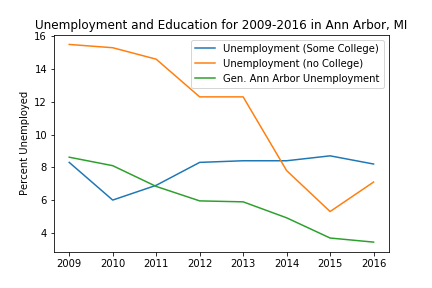

# Unemployment Analysis


Prerequisites:
  - Pandas
  - Numpy
  - matplotlib
  
  ```
  pip install pandas
  pip install numpy
  python -mpip install -U matplotlib
  ```
About This Project


  - My visual shows the growth and decline of the unemployment rate for those with just a high school diploma as well as those with some college experience. It also shows the general unemployment rate for the area of Ann Arbor, MI. 
  - The visual addresses my question by showing explicitly the trends for each of these variables in direct relation to one another. I thought about incorporating the labor force participation rate (as that can sometimes explain a decrease in unemployment) however I decided against it for fear of over clutter.

  - My Visual shows that for the most part, unemployment remains fairly steady at 8% for those who have some college experience but no college degree. 

  - However the trend for those with just a high school diploma shows a much less stable reality. 
  - For those with just a high school diploma the visual shows that just after the recession unemployment was very high for them compared to the rest of the workers in Ann Arbor. 
  - It also shows that as the years have gone on the unemployment rate for those with just a high school diploma has dropped dramatically. 
This trend never seems to find any sort of consistency and is always moving. 
  - There are other factors that I would like to explore to help explain some of the things seen in this visual. 

I was unable to find reliable information regarding average income in Ann Arbor for the various levels of education. Adding that in will be interesting.

Sources:
https://data.bls.gov/timeseries/LAUMT261146000000003?amp%253bdata_tool=XGtable&output_view=data&include_graphs=true
https://factfinder.census.gov/faces/tableservices/jsf/pages/productview.xhtml?pid=ACS_16_5YR_S2301&prodType=table
